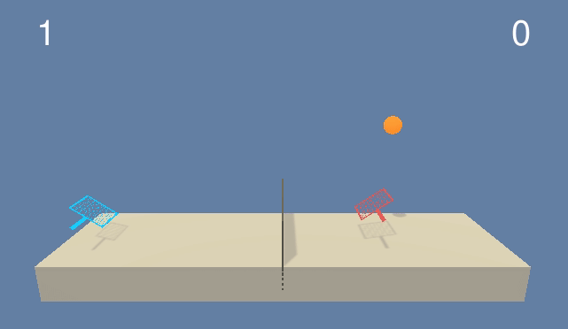

# Deep Reinforcement Learning Project 3
# Unity Tennis

## Project Details
* This project is the third mandatory project in Udacity Deep Reinforcement Learning Nanodegree.
* The goal is to train two agents to play a tennis game and keep it in play. The rewards are as follows:
  * `+0.1` if the agent hit the ball and it goes over the net
  * `-0.01` if the agent let the ball touch the ground or hit the ball out of the bounds
* Two continuous actions:
  * Movement along the field
  * Jumping
* The observation space has 8 dimensions consisting of position and velocity of the ball and racket. Each agent receives its own local observation.
### Task requirements
* Code must be written in Python 3
* PyTorch must be used
* Agent must be able to get average score of 13 from 100 consecutive episodes

## Getting Started
1. Clone the DRLND Repository https://github.com/udacity/deep-reinforcement-learning/#dependencies
2. Download the Unity Environment
	* For this project, you will not need to install Unity - this is because Udacity have already built the environment for you, and you can download it from one of the links below. You need only select the environment that matches your operating system:
		* Linux: [click here](https://s3-us-west-1.amazonaws.com/udacity-drlnd/P3/Tennis/Tennis_Linux.zip)
		* Mac OSX: [click here](https://s3-us-west-1.amazonaws.com/udacity-drlnd/P3/Tennis/Tennis.app.zip)
		* Windows (32-bit): [click here](https://s3-us-west-1.amazonaws.com/udacity-drlnd/P3/Tennis/Tennis_Windows_x86.zip)
		* Windows (64-bit): [click here](https://s3-us-west-1.amazonaws.com/udacity-drlnd/P3/Tennis/Tennis_Windows_x86_64.zip)
3. Place the Unity Environment file from step 2 in the p3_collab-compet/ folder in the DRLND GitHub repository, and unzip (or decompress) the file. p3_collab-compet/ folder is from DRLND (step 1).

## Instruction
1. Open tennis.py to start training the agent.
2. Open play_the_agent.py to watch agent plays.
